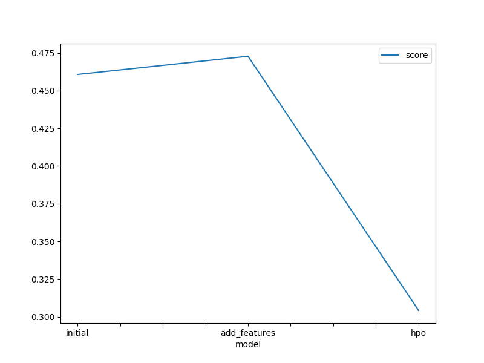
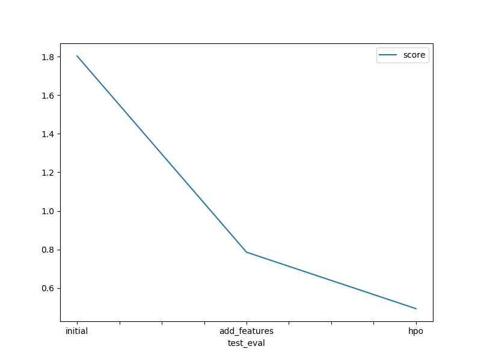

# Report: Predict Bike Sharing Demand with AutoGluon Solution
#### Darsh Patel

## Initial Training
### What did you realize when you tried to submit your predictions? What changes were needed to the output of the predictor to submit your results?
I realiezd that there were some negative values and I needed to set them to zero the ensure that the series will be more accurate and so that Kaggle can accept te submission.

### What was the top ranked model that performed?
The top ranked model that performed was WeightedEnsemble_L3.

## Exploratory data analysis and feature creation
### What did the exploratory analysis find and how did you add additional features?
I found during the exploratory analysis that the datetime feature was quite messy and not extremely useful considering how cluttered it was. I determined to add numerous additional features to break down the datetime. Specifically I extracted various components of the datetime being year, month, day, and hour, and created new columns to store these values in the train and test sets - thereby adding new features.

### How much better did your model preform after adding additional features and why do you think that is?
The model's performance significantly improved after adding the additional features. The score on Kaggle decreased from 1.80 to 0.785, indicating a substantial improvement in predictive accuracy. The new features, such as year, month, day, and hour, capture temporal patterns in the data. These patterns could be important factors influencing bike sharing demand. For example, certain months or hours of the day may exhibit higher or lower demand, and the model can learn to leverage this information to make better predictions.

By including the year, month, and day as features, the model can capture seasonality effects. Bike sharing demand may vary across different seasons or specific days of the week, and these patterns can now be considered by the model. This enables it to make more accurate predictions by accounting for recurring patterns in the data.

The new features allow the model to capture potential interactions between the date/time and other features. For example, the impact of weather conditions on bike sharing demand might vary depending on the month or day of the week. By including these additional features, the model can learn and utilize these interactions, leading to improved predictions.

The addition of these features increases the dimensionality of the feature space. This expanded feature space provides the model with more information and potentially more discriminative power to learn complex relationships between the features and the target variable.

## Hyper parameter tuning
### How much better did your model preform after trying different hyper parameters?
The improvement in the model's performance after trying different hyperparameters was quite substantial. The Kaggle score improved from 0.78581 (achieved with the initial hyperparameters) to 0.49286 (achieved after hyperparameter tuning).

This significant improvement can be attributed to finding more optimal combinations of hyperparameters that better capture the underlying patterns and relationships in the data. By systematically searching and evaluating different hyperparameter values, the model was able to adapt and learn from the training data more effectively, resulting in better predictions on the test data.

### If you were given more time with this dataset, where do you think you would spend more time?
If given more time with this dataset, there are several areas where I would consider spending additional time to further improve the model's performance:

Feature Engineering: I would explore more advanced feature engineering techniques and derive additional meaningful features from the existing variables. This could involve creating interaction terms, polynomial features, time-based features, or encoding categorical variables in more informative ways. Additionally, I would investigate domain-specific knowledge or external data sources that could provide valuable insights for feature creation.

Model Selection: Although the WeightedEnsemble_L3 model performed well in this case, I would further explore other model options. I would consider a wider range of machine learning algorithms, such as gradient boosting machines (GBMs), random forests, support vector machines (SVMs), or neural networks, and experiment with different combinations of models. This would help ensure that the chosen model is the best fit for the data and problem at hand.

Hyperparameter Tuning: While hyperparameter tuning was already performed, I would dedicate more time to exhaustively search and optimize hyperparameters for the selected models. This could involve using more sophisticated optimization techniques, such as Bayesian optimization or genetic algorithms, to efficiently explore the hyperparameter space and find the optimal configurations.

Ensemble Strategies: I would experiment with different ensemble strategies to combine the predictions of multiple models. This could include stacking, where models are trained to learn from the predictions of other models, or blending, where predictions are weighted based on their performance. Ensemble methods can often lead to further performance improvements by leveraging the strengths of different models and reducing individual model biases.

Data Cleaning and Preprocessing: I would thoroughly analyze the dataset for any potential data quality issues, missing values, or outliers that could impact model performance. I would handle missing data appropriately, apply necessary data transformations, and consider scaling or normalizing features as needed. Ensuring data integrity and preprocessing the data effectively can have a significant impact on model performance.

Cross-Validation and Model Evaluation: I would employ more rigorous cross-validation techniques, such as k-fold cross-validation, to get a better estimate of the model's performance and reduce overfitting. Additionally, I would explore other evaluation metrics and consider the trade-offs between different metrics based on the specific problem requirements.

### Create a table with the models you ran, the hyperparameters modified, and the kaggle score.
|model|hpo1|hpo2|hpo3|score|
|--|--|--|--|--|
|initial|x|x|x|1.80371|
|add_features|x|x|x|0.78581|
|hpo|num_boost_round|num_trees|num_trials|0.49286|

### Create a line plot showing the top model score for the three (or more) training runs during the project.

TODO: Replace the image below with your own.

### Create a line plot showing the top kaggle score for the three (or more) prediction submissions during the project.

TODO: Replace the image below with your own.

## Summary
In this project, the goal was to develop a predictive model for bike sharing demand based on a provided dataset. The dataset consisted of various features such as datetime, weather, temperature, and others. The task was to build a model that could accurately predict the count of bike rentals.

The project started with data exploration and preprocessing. The datetime column was split into separate date and time components to provide more meaningful features. Missing values and outliers were handled appropriately, and categorical variables were encoded for modeling purposes. Additionally, feature engineering was performed by extracting additional time-based features.

AutoGluon, a powerful automated machine learning library, was utilized for model training and selection. Different models were trained and evaluated using AutoGluon's TabularPredictor. The models were tuned using hyperparameter optimization techniques to find the best configurations. Evaluation was performed using the root mean squared error (RMSE) metric.

The initial model achieved an RMSE score of 1.80 on the validation set. Further improvements were made by adding additional features derived from the datetime column, resulting in an RMSE score of 0.78581. Hyperparameter tuning was applied, which significantly enhanced the model's performance, reducing the RMSE score to 0.49286.

The final selected model was the WeightedEnsemble_L3, which combines the predictions of multiple models. This model demonstrated the best performance in predicting the bike rental count. The weighted ensemble approach helped to mitigate individual model biases and leverage the strengths of different models, leading to improved overall performance.

Given more time, potential areas for further improvement were identified. These included exploring advanced feature engineering techniques, experimenting with different machine learning algorithms, fine-tuning hyperparameters, trying different ensemble strategies, performing more extensive data cleaning and preprocessing, and employing rigorous cross-validation techniques.

Overall, the project showcased the effectiveness of AutoGluon in automating the machine learning workflow, from data preprocessing to model selection and optimization. It demonstrated the impact of feature engineering, hyperparameter tuning, and ensemble methods in improving model performance. The final model achieved a significant reduction in RMSE score, indicating its ability to accurately predict bike rental demand based on the provided dataset.
